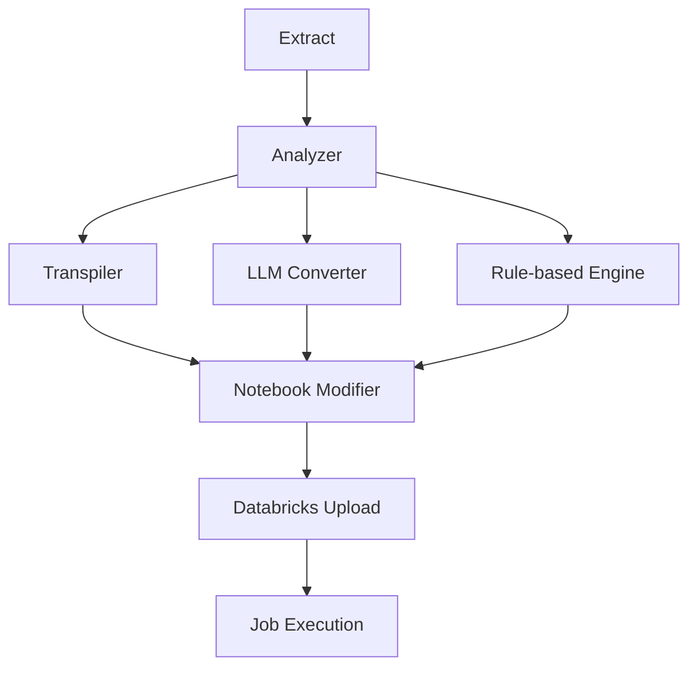

# Lakebridge_converter

# LakeBridge Utility 

## Requirements

### Core Dependencies
```python
groq
python-dotenv
nbformat
nbconvert
databricks-cli
pyyaml
```

### Configuration Requirements
Example
```yaml
analyzer:
  source_directory: Source_folder_path
  report_file: C:\Users\...\sample1.xlsx
  source_tech: Snowflake
transpiler:
  source_dialect: 
  input_source: Source_folder_path
  output_folder: Output_transpiled
  error_file_path: C:\Users\...\errors1
  catalog_name: workspace
  schema_name: default
  validate: 'true'
  warehouse: warehouse_id
  override: 'yes'
  open_config: 'yes'
modify:
  transpiled_dir: Output_transpiled
  output_dir: Output_modify_path
  llm_model: openai/gpt-oss-120b
  temperature: 0.1
upload:
  source_notebook_path: C:\Users\...\test_f_dt
  destination_directory: /Workspace/Users/email/dir_name
llm_converter:
  source_folder: C:\Users\...\test\test_f_llm
  output_folder: C:\Users\...\test\test2_f_out
  databricks_notebooks_folder: C:\Users\...\test\test_f_dt
  groq_api_key: api_key (optional) it is in env file
  llm_model: openai/gpt-oss-120b
  temperature: 0.1
  max_tokens: 4096
  catalog_name: workspace
  schema_name: default
  preserve_structure: true
  create_backup: true
```

## Installation
```bash
# Install requirements
pip install -r requirements.txt

# Configure Databricks CLI
databricks configure --token
```

## Execution Flow


## Key Configuration Paths
1. **Source SQL Files**: `C:\...\test1\` (Snowflake scripts)
2. **Transpiled Output**: `C:\...\transpiled\`
3. **Databricks Workspace**: `/Workspace/Users/.../llm_dttest`
4. **LLM_converter Source_Folder**: C:\Users\...\test\test_f_llm
5. **LLM_converter output_Folder**: C:\Users\...\test\test_f_out
6. **LLM_converter Databricks_notebook_Folder**: C:\Users\...\test\test_f_dt

## Running Modules
```bash
# Full pipeline execution for llm_converter
python main.py config.yaml --analyzer y --transpiler y --llm_converter y --upload y --sequential y

# Individual components
python main.py config.yaml --transpiler y  # Transpile only
python main.py config.yaml --upload y      # Upload notebooks
```

## Prerequisites
1. Active Databricks workspace with:
   - Catalog: `workspace`
   - Schema: `default`
   - Warehouse ID: `Warehouse_ID`
2. Groq API key for LLM conversions
3. Snowflake SQL scripts in specified source directory
